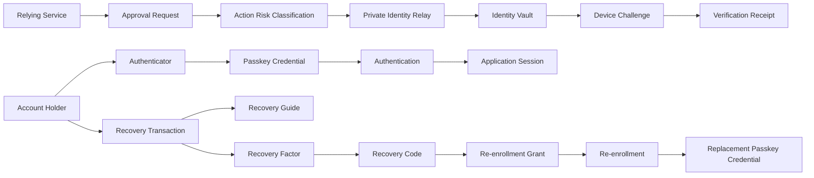

# Domain Dictionary: Authidenty

Created: 2026-07-15
Domain: account authentication and recovery
Version: v4 private identity relay
Audience: product, engineering, security, and hackathon reviewers

## Core Terms

### Private Identity Relay

- Definition: the Authidenty boundary that accepts a pseudonymous approval request, privately routes a challenge to an enrolled account holder, and returns a minimal verification result without disclosing the contact destination.
- Identifier: `privateIdentityRelay`, shortened to `relay` inside the feature module.
- UI: “private approval relay” or “Authidenty relay.”
- Avoid: “AI identity proof,” “anonymous SMS,” or “zero-knowledge identity.”

### Relying Service

- Definition: the application or AI agent that asks Authidenty to obtain account-holder approval for a bounded action.
- Identifier: `relyingService`.
- UI: the verified service display name.
- Avoid: `client` where it could mean a browser or HTTP library.

### Relay Handle

- Definition: an opaque, non-PII identifier issued for one account and presented by a Relying Service to select that account's relay profile.
- Identifier: `relayHandle`.
- UI: normally hidden or shortened.
- Avoid: email, phone number, username, or conversation embedding as the relay handle.

### Identity Vault

- Definition: the isolated persistence and cryptographic boundary that stores encrypted contact destinations and exposes them only to a Notification Adapter for a policy-approved request.
- Identifier: `identityVault`.
- UI: “private contact vault.”
- Avoid: implying that GPT can query or decrypt it.

### Approval Request

- Definition: a bounded Relying Service request asking an enrolled account holder to approve one described action.
- Identifier: `approvalRequest`, with `relayRequest` accepted in persistence and routes.
- UI: “approval request.”
- Avoid: “login” when the request concerns a payment, deletion, deployment, or account change.

### Action Risk Classification

- Definition: GPT-5.6's typed, PII-free interpretation of an action's purpose and suggested risk; deterministic policy computes the final risk and required factor.
- Identifier: `actionRiskClassification`.
- UI: “request summary.”
- Avoid: “AI security decision” or “AI authorization.”

### Device Challenge

- Definition: a short-lived proof routed to a previously enrolled device or destination and verified outside GPT.
- Identifier: `deviceChallenge`.
- UI: the concrete method, such as “text message code” or “passkey approval.”
- Avoid: calling delivery itself successful authentication.

### Verification Receipt

- Definition: a short-lived, pseudonymous record that a configured account-control challenge succeeded for one Approval Request.
- Identifier: `verificationReceipt`.
- UI: “verified approval receipt.”
- Avoid: claiming that it proves legal identity or arbitrary personal attributes.

### Account Holder

- Definition: the person controlling an Authidenty account.
- Identifier: `user` in existing persistence where changing it would add needless churn; `accountHolder` in product-facing domain prose when role clarity matters.
- UI: “you” or “account.”
- Avoid: “verified identity,” “citizen,” or “biometric owner.”

### Passkey Credential

- Definition: a WebAuthn public-key credential bound to an account; Authidenty stores only its public verification material and metadata.
- Identifier: `credential`, `passkeyCredential`.
- UI: “passkey.”
- Avoid: calling the server record a private key or biometric.

### Authenticator

- Definition: the device, platform, credential manager, or security key that holds and uses a passkey private key.
- Identifier: `authenticator`.
- UI: “this device,” “another device,” or “security key” when known.
- Avoid: using “passkey” and “authenticator” interchangeably.

### Authentication

- Definition: a WebAuthn ceremony that proves control of an active passkey credential and may create an application session.
- Identifier: `authentication`, `authenticate`.
- UI: “sign in.”
- Avoid: using authentication to describe GPT diagnosis or recovery-code verification.

### Application Session

- Definition: a short-lived server-recognized state created only after successful authentication.
- Identifier: `applicationSession`, `session` within the session module.
- UI: normally implicit as “signed in.”
- Avoid: calling a WebAuthn challenge, recovery transaction, or re-enrollment grant a session without qualification.

### Account Recovery

- Definition: the policy-controlled process used when every practical active passkey is unavailable and the holder must establish replacement account control.
- Identifier: `accountRecovery`, `recovery` within the recovery module.
- UI: “recover access.”
- Avoid: calling normal another-device passkey authentication recovery.

### Recovery Transaction

- Definition: a short-lived workflow record containing non-secret diagnostic and policy state for one recovery attempt.
- Identifier: `recoveryTransaction`.
- UI: “recovery attempt” only when needed.
- Avoid: treating it as authenticated or authorized state.

### Recovery Factor

- Definition: an independent, preconfigured proof used by deterministic policy to authorize recovery.
- Identifier: `recoveryFactor`.
- UI: the concrete method name, such as “recovery code.”
- Avoid: calling conversation style, GPT confidence, or email ownership a recovery factor in this MVP.

### Recovery Code

- Definition: a high-entropy saved recovery secret shown once, stored only as a server-side digest, throttled, and redeemable once.
- Identifier: `recoveryCode` for transient plaintext and `recoveryCodeDigest` for persistence.
- UI: “recovery code.”
- Avoid: “backup password” or sending the code to GPT.

### Recovery Guide

- Definition: the GPT-5.6 component that diagnoses likely passkey failures and explains only server-approved next steps.
- Identifier: `recoveryGuide`, existing `recoveryAgent` is accepted during the MVP.
- UI: “GPT-5.6 recovery guide” or “recovery guide.”
- Avoid: “AI authenticator,” “identity agent,” or “AI approval.”

### Re-enrollment Grant

- Definition: a short-lived, one-time authorization to register one replacement passkey after deterministic recovery-factor verification.
- Identifier: `reenrollmentGrant`.
- UI: “replacement authorization” when it must be shown.
- Avoid: “login token,” “session,” or a general bearer authorization.

### Re-enrollment

- Definition: the WebAuthn registration of a replacement passkey under a valid re-enrollment grant.
- Identifier: `reenrollment`, `reenroll`.
- UI: “create replacement passkey.”
- Avoid: relaxing ordinary registration conflict checks or using `skipConflictCheck`.

### Credential Status

- Definition: the server-owned lifecycle state of a passkey credential, initially `active` and terminally `revoked` in the MVP.
- Identifier: `credentialStatus`, values `active` and `revoked`.
- UI: “Active” and “Revoked.”
- Avoid: “deleted” when the minimal audit record remains.

### Backup State

- Definition: the WebAuthn backup eligibility and current backup-state signals reported for a credential; it does not mean Authidenty stores a backup.
- Identifier: existing `deviceType` and `backedUp`, or explicit `backupEligible`/`backupState` if introduced.
- UI: “Synced” or “Device-bound” only when the evidence supports that wording.
- Avoid: “backed up by Authidenty.”

### Recovery Readiness

- Definition: the availability of independent active methods that can avoid or authorize Account Recovery.
- Identifier: `recoveryReadiness`.
- UI: “Recovery ready” followed by concrete evidence, never a vague score.
- Avoid: using GPT confidence or conversational similarity as readiness.

### Recovery Action

- Definition: a server-owned navigation option permitted for the current Recovery Transaction.
- Identifier: `recoveryAction`.
- UI: a concrete action such as “Use another passkey” or “Verify recovery code.”
- Avoid: executing URLs, commands, or privileges generated in model prose.

### Security Authorization Panel

- Definition: the UI region that displays deterministic Recovery Factor, Re-enrollment Grant, and credential state separately from Recovery Guide text.
- Identifier: `SecurityAuthorizationPanel`.
- UI: “Security authorization.”
- Avoid: styling it as a chat message or implying GPT performed verification.

### Ceremony State

- Definition: short-lived, one-time challenge state for one WebAuthn registration or Authentication ceremony.
- Identifier: `ceremonyState`; existing `webauthnChallenge` remains the persistence term.
- UI: normally hidden; display only waiting/expired status.
- Avoid: calling it an Application Session.

### Recovery Attempt Throttle

- Definition: server state that limits Recovery Factor verification attempts across account and client signals.
- Identifier: `recoveryAttemptThrottle`.
- UI: “Try again later” without revealing threshold internals.
- Avoid: treating throttling as proof that the user is an attacker.

### Recovery Notification

- Definition: an account-control alert recorded or delivered after recovery and credential change.
- Identifier: `recoveryNotification`.
- UI: distinguish “recorded” from “sent” or “delivered.”
- Avoid: claiming notification delivery when the MVP stores only an outbox record.

### Identity Proofing

- Definition: establishing a relationship between a real-world identity and an account using identity evidence; this is outside Authidenty's MVP.
- Identifier: `identityProofing` in documentation only.
- UI: not offered.
- Avoid: claiming that account-control recovery proves civil identity.

## Relationship Map

## External Standards Mapping

| Project term | External reference | Mapping |
|---|---|---|
| Passkey Credential | W3C WebAuthn public-key credential | Direct technical mapping |
| Authenticator | W3C WebAuthn authenticator | Direct technical mapping |
| Recovery Code | NIST saved recovery code | Prototype subset; no AAL2 compliance claim |
| Backup State | WebAuthn BE/BS flags | Product wording derived from credential metadata |

## Prohibited Wording

| Avoid | Use instead | Reason |
|---|---|---|
| LLM identifies the person | GPT classifies the approval request | The model does not authenticate or inspect PII |
| GPT unlocks the phone number | Server policy authorizes private challenge routing | The model cannot access the Identity Vault |
| phone number is not exposed anywhere | phone number is hidden from the relying service, UI, and model | The vault boundary and carrier still process the destination |
| AI authentication | GPT-guided recovery | The model does not authenticate |
| prove who you are | prove control of a configured factor | No civil-identity proofing occurs |
| biometric stored | device performs user verification | Biometrics remain with the authenticator |
| passkey recovery for another synced device | sign in with another passkey | It is normal authentication |
| recovery session | recovery transaction or re-enrollment grant | Prevent privilege and cookie confusion |

## Change History

| Date | Change | Reason |
|---|---|---|
| 2026-07-16 | v4 added Private Identity Relay terms | Approved pivot from recovery guide to privacy-preserving approval routing |
| 2026-07-15 | v1 draft with 15 terms | Zephermine spec synthesis |
| 2026-07-15 | v2 expert merge with 6 terms and refined recovery contracts | Team review |
| 2026-07-15 | v3 final with no unresolved conflicts | Domain confirmation |
