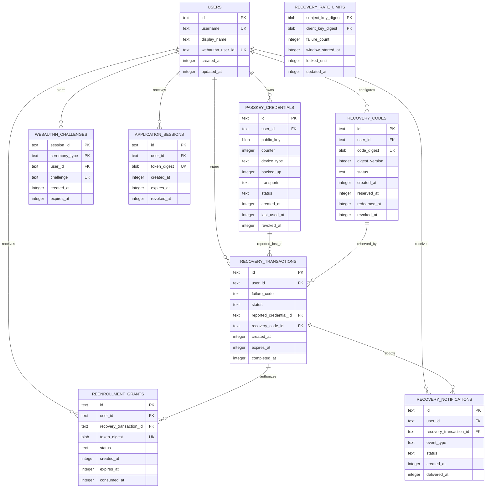

# Database Schema

## Target Database

- Database: SQLite through `better-sqlite3`.
- Reason: the existing application and tests already use SQLite, the hackathon requires one small transactional deployment, and immediate transactions support the one-time recovery invariants.
- Deployment boundary: the final runtime must provide persistent storage and a single writer/process. Ephemeral or horizontally scaled serverless SQLite is not supported by this plan.
- Migration: add reversible `002_authentication_recovery.up.sql` and `.down.sql`; do not edit migration 001.

## Access Patterns

1. Find an Account Holder by normalized username.
2. Find an active Passkey Credential by ID and verify it belongs to the expected user.
3. List active credentials for setup, Authentication, Recovery Readiness, and revocation selection.
4. Consume one Ceremony State by session ID and type.
5. Find an Application Session by high-entropy token digest and expiry.
6. Find the current active/reserved Recovery Code for a user.
7. Reserve one Recovery Code to one Recovery Transaction atomically.
8. Find an active Re-enrollment Grant by token digest and consume it once.
9. Release expired code reservations and expire transactions/grants.
10. List a user's credential state and Recovery Notification records for the completion receipt.

## ERD



## Final SQLite DDL

This is the target schema contract. Migration 002 may rebuild existing tables where SQLite cannot add the required constraint safely.

```sql
PRAGMA foreign_keys = ON;

CREATE TABLE users (
  id TEXT PRIMARY KEY,
  username TEXT NOT NULL COLLATE NOCASE UNIQUE
    CHECK (length(username) BETWEEN 3 AND 254),
  display_name TEXT NOT NULL
    CHECK (length(display_name) BETWEEN 1 AND 80),
  webauthn_user_id TEXT NOT NULL UNIQUE
    CHECK (length(webauthn_user_id) BETWEEN 32 AND 128),
  created_at INTEGER NOT NULL DEFAULT (unixepoch()),
  updated_at INTEGER NOT NULL DEFAULT (unixepoch())
);

CREATE TABLE passkey_credentials (
  id TEXT PRIMARY KEY,
  user_id TEXT NOT NULL,
  public_key BLOB NOT NULL CHECK (length(public_key) > 0),
  counter INTEGER NOT NULL DEFAULT 0 CHECK (counter >= 0),
  device_type TEXT NOT NULL
    CHECK (device_type IN ('singleDevice', 'multiDevice')),
  backed_up INTEGER NOT NULL DEFAULT 0
    CHECK (backed_up IN (0, 1)),
  transports TEXT NOT NULL DEFAULT '[]'
    CHECK (json_valid(transports) AND json_type(transports) = 'array'),
  status TEXT NOT NULL DEFAULT 'active'
    CHECK (status IN ('active', 'revoked')),
  created_at INTEGER NOT NULL DEFAULT (unixepoch()),
  last_used_at INTEGER,
  revoked_at INTEGER,
  FOREIGN KEY (user_id) REFERENCES users(id) ON DELETE CASCADE,
  CHECK (
    (status = 'active' AND revoked_at IS NULL) OR
    (status = 'revoked' AND revoked_at IS NOT NULL)
  )
);

CREATE TABLE webauthn_challenges (
  session_id TEXT NOT NULL,
  ceremony_type TEXT NOT NULL
    CHECK (ceremony_type IN ('registration', 'authentication', 'reenrollment')),
  user_id TEXT NOT NULL,
  challenge TEXT NOT NULL UNIQUE
    CHECK (length(challenge) BETWEEN 32 AND 512),
  created_at INTEGER NOT NULL DEFAULT (unixepoch()),
  expires_at INTEGER NOT NULL,
  PRIMARY KEY (session_id, ceremony_type),
  FOREIGN KEY (user_id) REFERENCES users(id) ON DELETE CASCADE,
  CHECK (expires_at > created_at)
);

CREATE TABLE application_sessions (
  id TEXT PRIMARY KEY,
  user_id TEXT NOT NULL,
  token_digest BLOB NOT NULL UNIQUE CHECK (length(token_digest) = 32),
  created_at INTEGER NOT NULL DEFAULT (unixepoch()),
  expires_at INTEGER NOT NULL,
  revoked_at INTEGER,
  FOREIGN KEY (user_id) REFERENCES users(id) ON DELETE CASCADE,
  CHECK (expires_at > created_at),
  CHECK (revoked_at IS NULL OR revoked_at >= created_at)
);

CREATE TABLE recovery_codes (
  id TEXT PRIMARY KEY,
  user_id TEXT NOT NULL,
  code_digest BLOB NOT NULL UNIQUE CHECK (length(code_digest) = 32),
  digest_version INTEGER NOT NULL DEFAULT 1 CHECK (digest_version > 0),
  status TEXT NOT NULL DEFAULT 'active'
    CHECK (status IN ('active', 'reserved', 'redeemed', 'revoked')),
  created_at INTEGER NOT NULL DEFAULT (unixepoch()),
  reserved_at INTEGER,
  redeemed_at INTEGER,
  revoked_at INTEGER,
  FOREIGN KEY (user_id) REFERENCES users(id) ON DELETE CASCADE,
  CHECK (
    (status = 'active' AND reserved_at IS NULL AND redeemed_at IS NULL AND revoked_at IS NULL) OR
    (status = 'reserved' AND reserved_at IS NOT NULL AND redeemed_at IS NULL AND revoked_at IS NULL) OR
    (status = 'redeemed' AND redeemed_at IS NOT NULL AND revoked_at IS NULL) OR
    (status = 'revoked' AND revoked_at IS NOT NULL)
  )
);

CREATE TABLE recovery_transactions (
  id TEXT PRIMARY KEY,
  user_id TEXT NOT NULL,
  failure_code TEXT NOT NULL
    CHECK (failure_code IN (
      'DEVICE_LOST',
      'PASSKEY_NOT_FOUND',
      'PROMPT_CANCELLED',
      'USER_VERIFICATION_FAILED',
      'RECOVERY_FACTOR_UNAVAILABLE'
    )),
  status TEXT NOT NULL DEFAULT 'diagnosing'
    CHECK (status IN (
      'diagnosing',
      'factor_required',
      'authorized',
      'enrolling',
      'completed',
      'expired',
      'cancelled'
    )),
  reported_credential_id TEXT,
  recovery_code_id TEXT,
  created_at INTEGER NOT NULL DEFAULT (unixepoch()),
  expires_at INTEGER NOT NULL,
  completed_at INTEGER,
  FOREIGN KEY (user_id) REFERENCES users(id) ON DELETE CASCADE,
  FOREIGN KEY (reported_credential_id) REFERENCES passkey_credentials(id) ON DELETE SET NULL,
  FOREIGN KEY (recovery_code_id) REFERENCES recovery_codes(id) ON DELETE RESTRICT,
  CHECK (expires_at > created_at),
  CHECK (
    (status = 'completed' AND completed_at IS NOT NULL) OR
    (status <> 'completed' AND completed_at IS NULL)
  )
);

CREATE TABLE reenrollment_grants (
  id TEXT PRIMARY KEY,
  user_id TEXT NOT NULL,
  recovery_transaction_id TEXT NOT NULL,
  token_digest BLOB NOT NULL UNIQUE CHECK (length(token_digest) = 32),
  status TEXT NOT NULL DEFAULT 'active'
    CHECK (status IN ('active', 'consumed', 'expired', 'revoked')),
  created_at INTEGER NOT NULL DEFAULT (unixepoch()),
  expires_at INTEGER NOT NULL,
  consumed_at INTEGER,
  FOREIGN KEY (user_id) REFERENCES users(id) ON DELETE CASCADE,
  FOREIGN KEY (recovery_transaction_id) REFERENCES recovery_transactions(id) ON DELETE CASCADE,
  CHECK (expires_at > created_at),
  CHECK (
    (status = 'consumed' AND consumed_at IS NOT NULL) OR
    (status <> 'consumed' AND consumed_at IS NULL)
  )
);

CREATE TABLE recovery_rate_limits (
  subject_key_digest BLOB NOT NULL CHECK (length(subject_key_digest) = 32),
  client_key_digest BLOB NOT NULL CHECK (length(client_key_digest) = 32),
  failure_count INTEGER NOT NULL DEFAULT 0 CHECK (failure_count >= 0),
  window_started_at INTEGER NOT NULL,
  locked_until INTEGER,
  updated_at INTEGER NOT NULL DEFAULT (unixepoch()),
  PRIMARY KEY (subject_key_digest, client_key_digest)
);

CREATE TABLE recovery_notifications (
  id TEXT PRIMARY KEY,
  user_id TEXT NOT NULL,
  recovery_transaction_id TEXT NOT NULL,
  event_type TEXT NOT NULL
    CHECK (event_type IN ('recovery_completed', 'credential_revoked')),
  status TEXT NOT NULL DEFAULT 'recorded'
    CHECK (status IN ('recorded', 'sent', 'delivered', 'failed')),
  created_at INTEGER NOT NULL DEFAULT (unixepoch()),
  delivered_at INTEGER,
  FOREIGN KEY (user_id) REFERENCES users(id) ON DELETE CASCADE,
  FOREIGN KEY (recovery_transaction_id) REFERENCES recovery_transactions(id) ON DELETE CASCADE,
  CHECK (
    (status = 'delivered' AND delivered_at IS NOT NULL) OR
    (status <> 'delivered' AND delivered_at IS NULL)
  )
);

CREATE INDEX idx_passkey_credentials_user_status
  ON passkey_credentials(user_id, status);
CREATE INDEX idx_webauthn_challenges_user_id
  ON webauthn_challenges(user_id);
CREATE INDEX idx_webauthn_challenges_expires_at
  ON webauthn_challenges(expires_at);
CREATE INDEX idx_application_sessions_user_id
  ON application_sessions(user_id);
CREATE INDEX idx_application_sessions_expires_at
  ON application_sessions(expires_at);
CREATE UNIQUE INDEX idx_recovery_codes_current_user
  ON recovery_codes(user_id)
  WHERE status IN ('active', 'reserved');
CREATE INDEX idx_recovery_transactions_user_status
  ON recovery_transactions(user_id, status);
CREATE INDEX idx_recovery_transactions_expires_at
  ON recovery_transactions(expires_at);
CREATE UNIQUE INDEX idx_recovery_transactions_reserved_code
  ON recovery_transactions(recovery_code_id)
  WHERE status IN ('authorized', 'enrolling');
CREATE INDEX idx_reenrollment_grants_user_id
  ON reenrollment_grants(user_id);
CREATE INDEX idx_reenrollment_grants_expires_at
  ON reenrollment_grants(expires_at);
CREATE UNIQUE INDEX idx_reenrollment_grants_active_transaction
  ON reenrollment_grants(recovery_transaction_id)
  WHERE status = 'active';
CREATE INDEX idx_recovery_rate_limits_locked_until
  ON recovery_rate_limits(locked_until);
CREATE INDEX idx_recovery_notifications_user_created
  ON recovery_notifications(user_id, created_at DESC);
```

## Design Rationale

| Table | Relationship | Rationale |
|---|---|---|
| `users` | Root entity | Existing minimal Account Holder record; username remains normalized and unique |
| `passkey_credentials` | Users 1:N | Supports multiple credentials and terminal revocation without deleting audit evidence |
| `webauthn_challenges` | Users 1:N | Existing one-time Ceremony State extended with `reenrollment` purpose |
| `application_sessions` | Users 1:N | Opaque server-backed Application Session, distinct from all recovery state |
| `recovery_codes` | Users 1:N history, one current | Preserves rotation history while a partial unique index permits one active/reserved code |
| `recovery_transactions` | Users 1:N | Owns diagnostic and recovery workflow state without storing conversation text |
| `reenrollment_grants` | Transaction 1:N history, one active | Supports expiry history and prevents multiple simultaneous active grants |
| `recovery_rate_limits` | Digest pair | Handles unknown usernames without creating a user record and avoids raw identifier/client storage |
| `recovery_notifications` | Transaction 1:N | Honest outbox evidence; recorded does not imply delivered |

## Transaction Boundaries

### Reserve Recovery Code

One immediate transaction must:

1. expire/release stale reservations relevant to the subject;
2. verify the current Recovery Code status is `active`;
3. change it to `reserved` and set `reserved_at`;
4. bind its ID to the Recovery Transaction and set status `authorized`;
5. insert exactly one active Re-enrollment Grant;
6. clear or update the Recovery Attempt Throttle after success.

### Complete Replacement

WebAuthn verification happens before the database write transaction. One immediate transaction then:

1. rechecks the grant, transaction, code reservation, and user binding;
2. inserts the replacement Passkey Credential;
3. consumes the grant and completes the Recovery Transaction;
4. revokes the explicitly reported old credential;
5. marks the old Recovery Code `redeemed`;
6. inserts the digest for the newly generated Recovery Code;
7. records Recovery Notification events.

The new plaintext Recovery Code exists only in process memory and the single successful response.

## Index Strategy

- Unique digests provide constant-time lookup for high-entropy cookies/grants/codes.
- Foreign-key and user/status indexes cover Authentication, Recovery Readiness, and completion receipt queries.
- Expiry indexes support opportunistic cleanup on request without a background scheduler.
- Partial unique indexes enforce one current code, one reserved transaction per code, and one active grant per transaction.
- No index is added solely for the demo UI if the query can use an existing user/status index.

## Migration Notes

1. Migration 002 runs with `PRAGMA foreign_keys = OFF` only during a tested table-rebuild sequence, then restores it and runs `PRAGMA foreign_key_check` before commit.
2. Existing `passkey_credentials` rows backfill to `status = 'active'` and `revoked_at = NULL`.
3. Existing `webauthn_challenges` rows copy into a rebuilt table whose check constraint includes `reenrollment`.
4. New tables are additive and initially empty.
5. The down migration removes new tables/indexes and rebuilds the two existing tables to the migration-001 contract. It is acceptable for disposable prototype rollback to discard recovery/session state; it must preserve users and active credential public material.
6. Schema tests assert final DDL constraints and exercise up/down on a temporary database.

## Data Retention

- Expired challenges, sessions, grants, transactions, and throttles may be deleted opportunistically after the demo evidence window.
- Revoked public credentials and Recovery Notification records remain as minimal audit evidence in the prototype.
- Recovery Guide conversation text, plaintext Recovery Codes, private keys, and biometric/identity evidence are never persisted.
