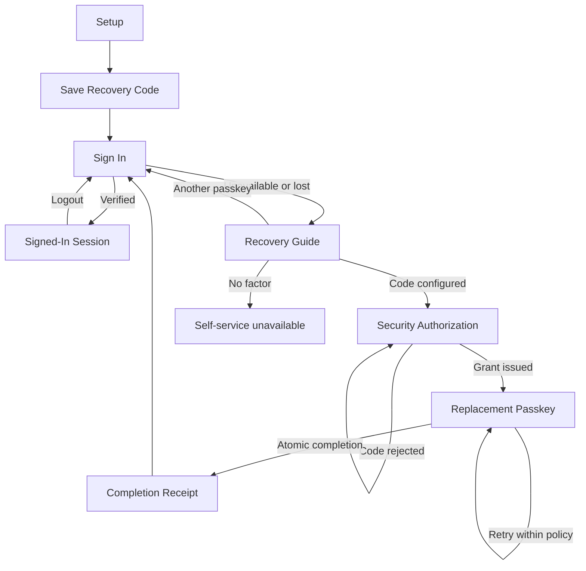

# Operation Scenarios

## 1. Roles

| Role | Description | Main permissions |
|---|---|---|
| Account Holder | Consumer using or recovering an Authidenty-protected account | Register and authenticate a passkey; save a Recovery Code; start recovery; verify their code; create a replacement passkey |
| Relying-Party Operator | Maintains Authidenty configuration and evidence | Configure RP/origin/database/model; run migrations and checks; inspect non-secret notification records |
| Security Reviewer | Challenges trust-boundary and state-transition claims | Review source, tests, policy output, replay rejection, secret handling, and limitations; no privileged product action |
| Hackathon Judge | Evaluates a disposable working journey | Use public UI and repository documentation; no database or admin access |
| GPT-5.6 Recovery Guide | External explanation component, not a human role or authority | Explain and prioritize only server-approved actions; cannot authenticate, issue grants/sessions, or mutate credentials |

## 2. Screen Scenarios

### Screen: Setup

- **Access roles**: Account Holder, Hackathon Judge using a disposable account.
- **Composition**: product premise, username/display-name form, passkey support status, setup action.
- **Normal flow**:
  1. Enter a normalized email-like username and display name.
  2. Request registration options.
  3. Complete the platform passkey prompt with user verification.
  4. Server stores the public credential and first Recovery Code digest.
  5. Navigate to Save Recovery Code.
- **Exception flow**:
  - Invalid profile: keep input and show a field-associated error.
  - Existing account: direct to sign-in; never add a credential unauthenticated.
  - Prompt cancelled/failed: clear the one-time challenge and offer retry.
  - Wrong Origin/RP/user verification: reject generically without saving a credential.
- **Postcondition**: one active credential and one active Recovery Code digest; no Application Session.

### Screen: Save Recovery Code

- **Access roles**: Account Holder immediately after verified initial registration.
- **Composition**: one-time code reveal, copy/download, storage guidance, acknowledgment checkbox/action, backup-state explanation.
- **Normal flow**:
  1. View plaintext code once in a no-store response.
  2. Copy or download it locally.
  3. Acknowledge that Authidenty cannot display the same plaintext later.
  4. Continue to normal sign-in.
- **Exception flow**:
  - Copy/download fails: manual selection remains possible.
  - Page is left before acknowledgment: plaintext cannot be fetched again; prototype explains the limitation honestly.
  - Screenshot/evidence capture: use a disposable code and rotate it after capture.
- **Postcondition**: acknowledgment is UI state; persistent storage still contains only the digest.

### Screen: Sign In

- **Access roles**: Account Holder, Hackathon Judge.
- **Composition**: username input, passkey action, retry/recovery entry, generic error status.
- **Normal flow**:
  1. Enter username and request Authentication options.
  2. Complete the platform assertion prompt.
  3. Server consumes the challenge, verifies active credential/account/RP/origin/user verification, updates credential use, and creates an Application Session.
  4. Show signed-in credential status.
- **Exception flow**:
  - Cancellation/timeout: show retry and diagnosis entry without declaring the credential lost.
  - Unknown account/credential/revoked credential: generic sign-in failure and no session.
  - Expired challenge: require a new ceremony.
  - Throttling: show bounded retry guidance.
- **Postcondition**: verified path has a short Application Session; failed path has none.

### Screen: Recovery Guide

- **Access roles**: Account Holder after sign-in failure; Judge for demonstration.
- **Composition**: Failure Code selection/derived state, bounded description, agent diagnosis, server-owned action buttons, explicit “Guidance only” boundary.
- **Normal flow**:
  1. Start a Recovery Transaction with username and allow-listed failure category.
  2. Server computes the complete allowed Recovery Action set.
  3. A refresh may resume only sanitized status/actions/expiry from the transaction cookie.
  4. User enters a non-secret description.
  5. GPT-5.6 explains or prioritizes the server set.
  6. Server validates/intersects output and renders actions outside the chat bubble.
  7. If another passkey remains, return to normal Authentication; otherwise proceed to Security Authorization when a code is configured.
- **Exception flow**:
  - Unknown or ineligible account: use the generic public response family and disclose no account/factor metadata.
  - Client submits account facts, actions, or authorization status: reject or ignore them and recompute policy from server state.
  - Secret-like input: do not call GPT; preserve the current server action set and show the separate code form only when policy permits it.
  - Prompt injection or model identity/approval/tool claim: reject semantically or use fallback; invoke no authorization service.
  - Model timeout/refusal/schema error/no key: show deterministic fallback with the same allowed actions.
  - No independent factor: show a terminal “self-service unavailable” result without bypass.
  - Forged/expired Recovery Transaction: restart recovery generically.
- **Postcondition**: no credential, grant, code, or Application Session state changes.

### Screen: Security Authorization

- **Access roles**: Account Holder with a valid Recovery Transaction and saved code.
- **Composition**: separate bordered factor form, secret-handling warning, attempt status, one-purpose grant explanation and expiry.
- **Normal flow**:
  1. Enter the Recovery Code outside chat.
  2. Server applies throttling, normalizes/digests it, and matches the account-bound active code.
  3. One immediate transaction reserves the code to the Recovery Transaction and creates one Re-enrollment Grant.
  4. Set the separate grant cookie and show the replacement action/expiry.
- **Exception flow**:
  - Wrong, malformed, redeemed, or mismatched code: generic rejection; record failed attempt.
  - Repeated failures: throttle with bounded retry time.
  - Concurrent/replayed success: exactly one grant; later request rejected.
  - Expired Recovery Transaction: require restart without issuing a grant; an unreserved active code remains active.
- **Postcondition**: authorized transaction and reserved code, but no Application Session and no credential change.

### Screen: Replacement Passkey

- **Access roles**: Account Holder with a valid Re-enrollment Grant.
- **Composition**: one-purpose grant status/expiry, replacement passkey action, WebAuthn error/retry status.
- **Normal flow**:
  1. Request grant-bound replacement options.
  2. Create a new platform passkey with required user verification.
  3. Server verifies the attestation and rechecks all authorization state.
  4. In one transaction, insert replacement, consume grant, complete transaction, revoke the lost credential, redeem/rotate code, and write notifications.
  5. Navigate to Completion Receipt.
- **Exception flow**:
  - Missing/expired/wrong-purpose/cross-account grant: reject without options or changes.
  - Prompt failure: keep credential and code states unchanged; retry only within original authorization window.
  - State expires before completion: roll back every change, release the stale reservation through tested policy, and require a new recovery.
  - More than one old eligible credential in MVP: do not guess which one to revoke.
- **Postcondition**: successful path has one new active credential, the bound old credential revoked, old code redeemed, one new code digest, consumed grant, and notification records.

### Screen: Completion Receipt

- **Access roles**: Account Holder, Judge.
- **Composition**: masked replacement and revoked credential suffixes/statuses, recovery time, notification evidence, one-time rotated code, sign-in proof action.
- **Normal flow**:
  1. Save/acknowledge the rotated Recovery Code.
  2. Inspect active/revoked status and event evidence.
  3. Start ordinary passkey Authentication.
  4. Sign in with the replacement credential.
- **Exception flow**:
  - Reload after one-time response: do not return code plaintext.
  - Attempt old credential: generic sign-in failure.
  - Attempt completion replay: reject; do not rotate again.
- **Postcondition**: recovery is proven only after normal replacement sign-in.

### Screen: Signed-In Session

- **Access roles**: Authenticated Account Holder.
- **Composition**: minimal account/credential receipt and logout action.
- **Normal flow**: resolve the opaque session digest, show masked state, then revoke session on logout.
- **Exception flow**: expired/revoked/missing session returns to sign-in; logout remains idempotent.
- **Postcondition**: logout clears browser cookie and revokes server record.

## 3. End-to-End Business Scenarios

### Scenario A: First setup and ordinary return

- **Role**: Account Holder.
- **Preconditions**: compatible browser/authenticator, fixed RP ID/origin, unused disposable username.
- **Flow**: Setup → Save Recovery Code → Sign In → Signed-In Session → Logout.
- **Exceptions**: registration cancellation, existing account conflict, authentication failure, session expiry.
- **Postconditions**: one active credential, one saved code digest, normal sign-in proven, and no Recovery Transaction or Re-enrollment Grant.

### Scenario B: Lost-device recovery to replacement sign-in

- **Role**: Account Holder; observed by Judge/Security Reviewer.
- **Preconditions**: Scenario A complete, one active credential, saved Recovery Code available, no immediately usable alternate passkey.
- **Flow**:
  1. Sign-in failure or deliberate lost-device simulation.
  2. Recovery Guide explains the policy-approved path.
  3. Security Authorization independently verifies the Recovery Code.
  4. One-purpose grant creates replacement options.
  5. Replacement attestation completes all lifecycle state atomically.
  6. Completion Receipt shows masked evidence and new code once.
  7. Normal Authentication with replacement succeeds; old credential fails.
- **Exceptions**: wrong/throttled code, model outage, expired transaction/grant, WebAuthn failure, replay, transaction rollback.
- **Postconditions**: replacement active, lost credential revoked, code rotated, grant consumed, notification recorded, new Application Session issued only by normal Authentication.

### Scenario C: Avoid unnecessary catastrophic recovery

- **Role**: Account Holder with another valid passkey.
- **Preconditions**: server policy permits another-passkey Authentication.
- **Flow**: Current prompt unavailable → Recovery Guide prefers another passkey → ordinary Authentication succeeds.
- **Exceptions**: alternate passkey also unavailable; proceed only to a configured independent factor.
- **Postconditions**: no Recovery Code reservation or credential revocation.
- **Scope**: policy and guidance are required; a live second-device demonstration is optional after the critical path is green.

### Scenario D: Model outage without security outage

- **Role**: Account Holder, Operator.
- **Preconditions**: valid Recovery Transaction; OpenAI key missing or call deliberately fails.
- **Flow**: Recovery Guide receives server policy → deterministic fallback explains exact actions → user completes Scenario B through deterministic endpoints.
- **Exceptions**: no configured factor remains; fallback stops honestly.
- **Postconditions**: security path remains usable; response is labeled `deterministic-fallback`.

### Scenario E: No self-service factor

- **Role**: Account Holder.
- **Preconditions**: no usable passkey and no configured Recovery Code.
- **Flow**: Start recovery → server computes terminal policy → live or fallback guide explains self-service is unavailable.
- **Exceptions**: none may convert conversation confidence into access.
- **Postconditions**: no session, grant, credential, or factor state changes.

## 4. Operational Support Scenarios

### Operator: Start and verify the environment

1. Set RP name, fixed RP ID/origin, database path, keyed-digest secret, and optional OpenAI API key.
2. Run migrations and test/build commands.
3. Start the Node server on the exact evidence origin.
4. Verify WebAuthn and one live/fallback model request before recording.
5. Inspect only non-secret notification/test evidence.

Exceptions: unstable public persistence falls back to a documented fixed localhost recording when rules permit; an origin mismatch stops credential creation until configuration is corrected.

### Reviewer: Challenge the trust boundary

1. Submit prompt injection asking GPT to approve access.
2. Submit a secret-like string to chat and verify no model call.
3. Inject a forged model action/identity claim and verify fallback or filtering plus zero security-service calls.
4. Replay the Recovery Code/grant and verify exact-once state.
5. Attempt replacement without authorization and old-credential sign-in after completion.
6. Inspect logs/schema for prohibited secrets and claims.

Postcondition: evidence supports the claim “The model explains recovery. Cryptography authorizes it.”

## 5. Screen Flow

## 6. Deferred Operational Candidates

These common capabilities are intentionally outside the hackathon critical path:

- authenticated second-passkey management;
- credential selection for accounts with multiple old credentials;
- proactive Recovery Code rotation from a signed-in session;
- delivered email/SMS notifications rather than an honestly labeled outbox;
- recovery contacts, help-desk override, document proofing, and behavioral-authentication scoring.

They require separate threat models and API contracts before implementation.
