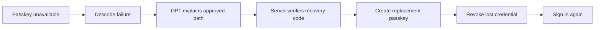
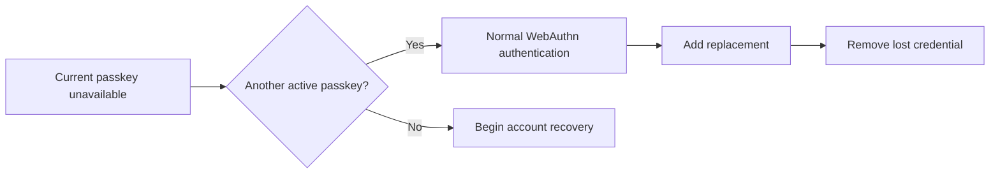

# Personas and Journeys

## Persona 1: Casey, locked-out everyday user

| Attribute | Description |
|---|---|
| Role | Consumer account holder |
| Goal | Regain account control after losing a phone without uploading an identity document |
| Frustration | Generic passkey errors, repeated codes, and recovery pages that do not explain consequences |
| Technical level | Beginner |
| Frequency | Signs in occasionally; recovery is rare and stressful |
| Core scenario | Lost phone, no immediately available passkey, saved recovery code exists |

### Journey: Lost device to replacement passkey

| Stage | Action | State of mind | Touchpoint | Product opportunity |
|---|---|---|---|---|
| Failure | Attempts sign-in and cannot find the passkey | Confused | Sign-in ceremony | Translate the actual failure without claiming certainty |
| Diagnose | Describes the lost phone | Anxious | GPT-5.6 recovery guide | Ask only safe questions and separate guidance from authorization |
| Prepare | Learns that the saved recovery code is required | Cautious | Server-approved action panel | Explain that the code stays outside the model |
| Verify | Enters the code in a dedicated form | Focused | Security authorization panel | Show server verification and short grant expiry |
| Replace | Creates a new passkey | Relieved | WebAuthn re-enrollment | Reuse familiar device prompt and preserve strict verification |
| Confirm | Sees the old credential revoked and signs in again | Confident | Credential receipt and sign-in | Make the security outcome concrete |

## Persona 2: Morgan, prepared passkey user

| Attribute | Description |
|---|---|
| Role | Consumer account holder with another passkey or synced credential |
| Goal | Continue safely without entering an unnecessary recovery ceremony |
| Frustration | Products label every passkey problem as account recovery and make credential state hard to understand |
| Technical level | Intermediate |
| Frequency | Signs in across multiple devices |
| Core scenario | Phone unavailable but laptop or credential provider can still authenticate |

### Journey: Avoid unnecessary recovery

| Stage | Action | State of mind | Touchpoint | Product opportunity |
|---|---|---|---|---|
| Failure | Current device cannot present the expected passkey | Mild concern | Sign-in ceremony | Detect retryable or another-device situations |
| Diagnose | Reports that another trusted device remains | Curious | Recovery guide | Explain that this is normal authentication, not identity recovery |
| Authenticate | Uses another passkey | Reassured | Another-device WebAuthn | Preserve phishing-resistant authorization |
| Repair | Adds a replacement credential and removes the lost one | In control | Credential management | Recommend correct replacement order and show backup state |

## Persona 3: Jordan, security-minded reviewer

| Attribute | Description |
|---|---|
| Role | Relying-party developer, security reviewer, or hackathon judge |
| Goal | Verify that GPT-5.6 is useful without becoming an authorization bypass |
| Frustration | AI demos often hide policy, store excessive context, or claim security from model confidence |
| Technical level | Expert |
| Frequency | Reviews one complete demo and source evidence |
| Core scenario | Inspects the boundary across diagnosis, factor verification, grant issuance, and credential revocation |

### Journey: Inspect the trust boundary

| Stage | Action | State of mind | Touchpoint | Product opportunity |
|---|---|---|---|---|
| Understand | Reads the one-sentence problem and architecture | Skeptical | Landing state and README | State the account-control claim precisely |
| Observe | Watches GPT diagnose a real failure | Evaluating | Agent diagnosis panel | Show structured allowed actions and no model tools |
| Verify | Watches the recovery factor and grant state change | Testing | Security authorization panel | Make deterministic server ownership visible |
| Challenge | Attempts replay or a model-injection prompt | Adversarial | Tests and demo fallback | Demonstrate rejection without hidden manual intervention |
| Conclude | Sees replacement sign-in and revoked old credential | Confident | Completion receipt | Tie impact, implementation, and safety together |

## Journey Design Consequences

- Casey's catastrophic-loss path is the required recorded demo.
- Morgan's alternate-passkey path is an optional enhancement after the critical path passes.
- Jordan's boundary view is not a separate admin dashboard; it is expressed through visible state labels, README architecture, and concise test evidence.
- Every user-facing state must use plain language first and technical vocabulary only as secondary evidence.
